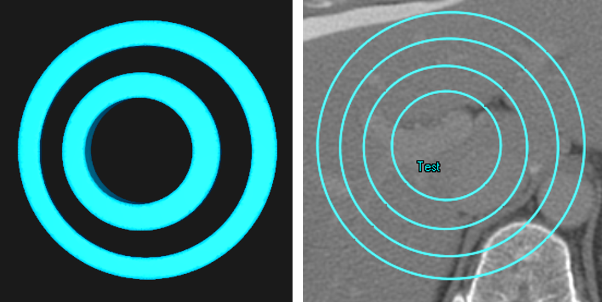

# This code provides functionality for turning dicom images and RT structures into nifti files as well as turning prediction masks back into RT structures
## Highly recommend to go through the jupyter notebook Data_Curation_and_Predictions_to_RT
## Data_Curation_and_Predictions_to_RT has three main parts
### 1) Identify RT structures and names in multiple patients
### 2) Creating associations file and turning dicom into nifti/numpy files
### 3) Turning predictions into RT structures
#### If you find this code useful, please provide a reference to my github page for others www.github.com/brianmanderson , thank you!
##### Please consider using https://github.com/brianmanderson/Dicom_Data_to_Numpy_Arrays if you are wanting a more parallel approach
##### Ring update allows for multiple rings to be represented correctly

Various utilities created to help with the interpretation of dicom images/RT Structures

RT Structure and dicom conversion to numpy arrays

This code is designed to receive an input path to a folder which contains both dicom images and a single RT structure file

For example, assume a folder exists with dicom files and an RT structure located at 'C:\users\brianmanderson\Patient_1\CT1\' with the roi 'Liver'

Assume there are 100 images, the generated data will be:
Dicom_Image.ArrayDicom is the image numpy array in the format [# images, rows, cols]

You can then call it to return a mask based on contour names called DicomImage.get_mask(), this takes in a list of Contour Names

You can see the available contour names with

Example:

    from Image_Array_And_Mask_From_Dicom_RT import Dicom_to_Imagestack
    Dicom_reader = Dicom_to_Imagestack(get_images_mask=False)
    path = 'C:\users\brianmanderson\Patients\'
    Dicom_reader.down_folder(path)
    # See all rois in the folders
    for roi in Dicom_reader.all_rois:
        print(roi)
    
    
    Contour_Names = ['Liver']
    associations = {'Liver_BMA_Program4':'Liver','Liver':'Liver'}
    path = 'C:\users\brianmanderson\Patients\Patient_1\CT_1\'
    Dicom_reader = Dicom_to_Imagestack(get_images_mask=True, Contour_Names=Contour_Names, associations=associations)
    
    Dicom_reader.Make_Contour_From_directory(path)
    image = DicomImage.ArrayDicom
    mask = DicomImage.mask

    pred = np.zeros([mask.shape[0],mask.shape[1],mask.shape[2],2]) # prediction needs to be [# images, rows, cols, # classes]
    pred[:,200:300,200:300,1] = 1
    
    output_path= os.path.join('.','Output')
    Dicom_reader.with_annotations(pred,output_path,ROI_Names=['test'])
    
    '''
    Write the images and annotations as niftii files in parallel!
    '''
    Dicom_Reader.write_parallel(out_path=export_path,excel_file=os.path.join('.','MRN_Path_To_Iteration.xlsx'))
    